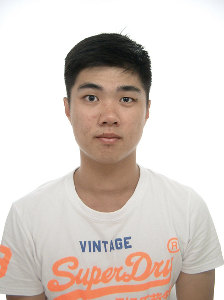
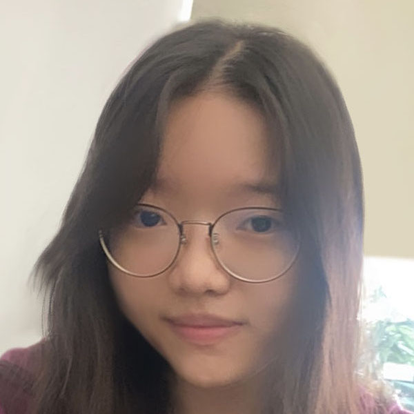
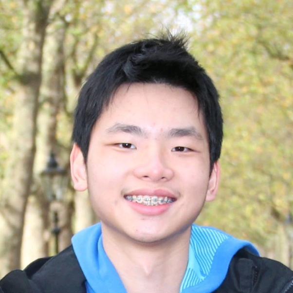
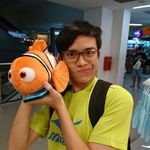

We are a team based in the [School of Computing, National University of Singapore](http://www.comp.nus.edu.sg).

### Chng Zi Hao

[[github](http://github.com/zihaooo9)]
[[portfolio](team/zihao.md)]

* Role: Placeholder guy
* Responsibilities: I identify as a placeholder

### Liaw Xin Yan

[[github](http://github.com/Lemonsr)]
[[portfolio](team/xinyan.md)]

* Role: UI Designer and Developer
* Responsibilities:

### Kleon Ang

[[github](http://github.com/kleonang)]
[[portfolio](team/kleon.md)]

* Role: Developer
* Responsibilities: Data

### Tan Yi Guan

[[github](http://github.com/tenebrius1)]
[[portfolio](team/yiguan.md)]

* Role: Developer
* Responsibilities:

### Kenneth Hong Jia Wei

[[github](http://github.com/knotstoks)]
[[portfolio](team/kennethhong.md)]

* Role: Developer
* Responsibilities: Burden
