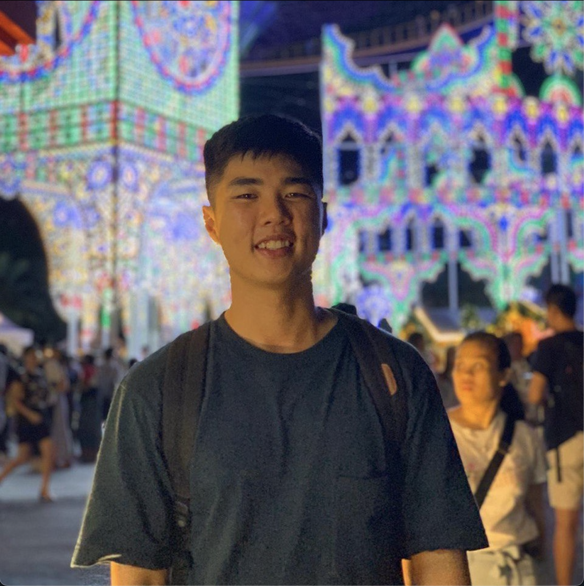

We are a team based in the [School of Computing, National University of Singapore](http://www.comp.nus.edu.sg).

### Chng Zi Hao

[[github](http://github.com/zihaooo9)]
[[portfolio](team/zihaooo9.md)]

* Role: Developer
* Responsibilities: Oversees testing and code coverage

### Liaw Xin Yan

[[github](http://github.com/Lemonsr)]
[[portfolio](team/lemonsr.md)]

* Role: UI Designer and Developer
* Responsibilities: Design and integrate code with GUI

### Kleon Ang

[[github](http://github.com/kleonang)]
[[portfolio](team/kleonang.md)]

* Role: Developer
* Responsibilities: Ensure code quality

### Tan Yi Guan

[[github](http://github.com/tenebrius1)]
[[portfolio](team/tenebrius1.md)]

* Role: Team Lead
* Responsibilities: Oversees whole project

### Kenneth Hong Jia Wei

[[github](http://github.com/knotstoks)]
[[portfolio](team/knotstoks.md)]

* Role: Developer
* Responsibilities: Maintain documentation
