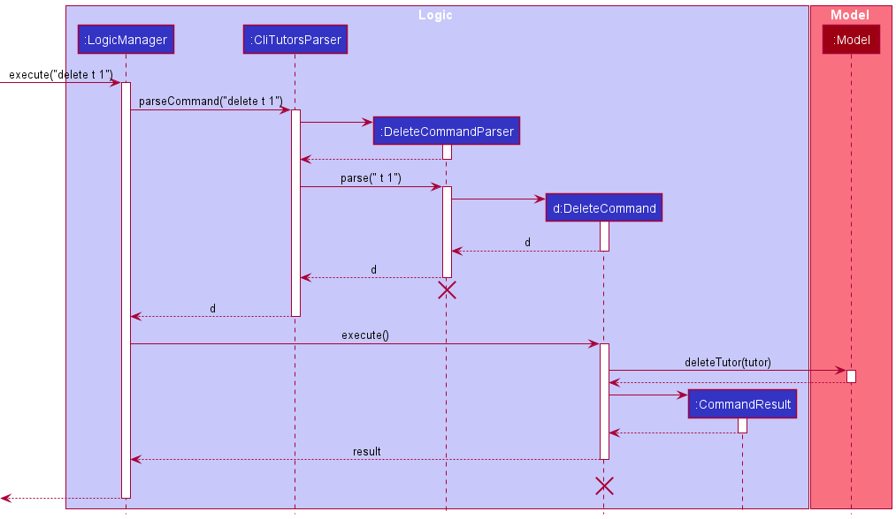
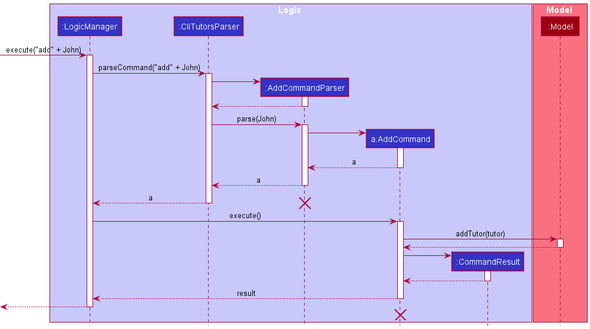
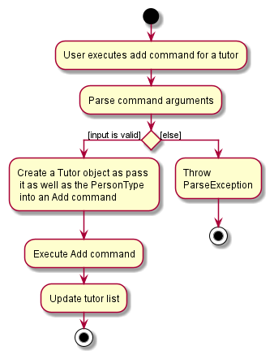
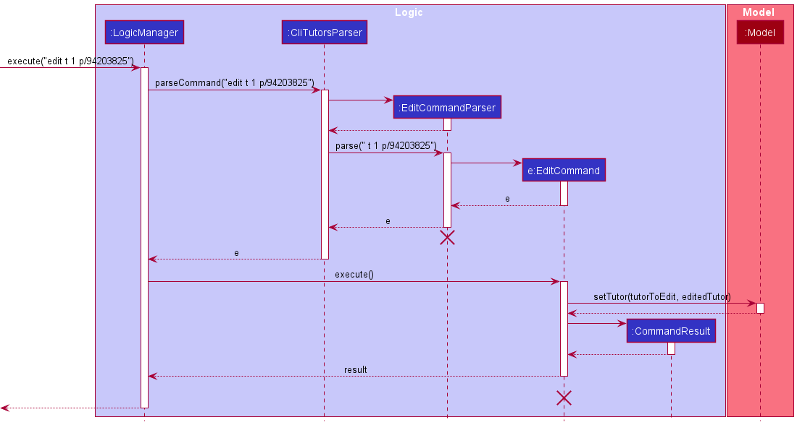
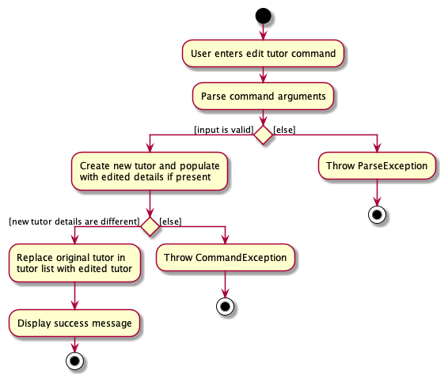
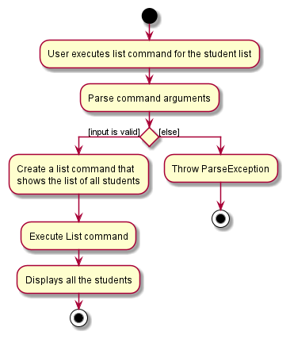
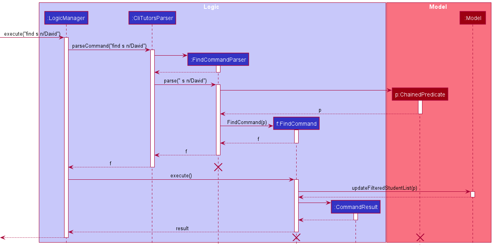
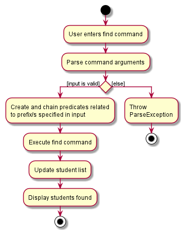
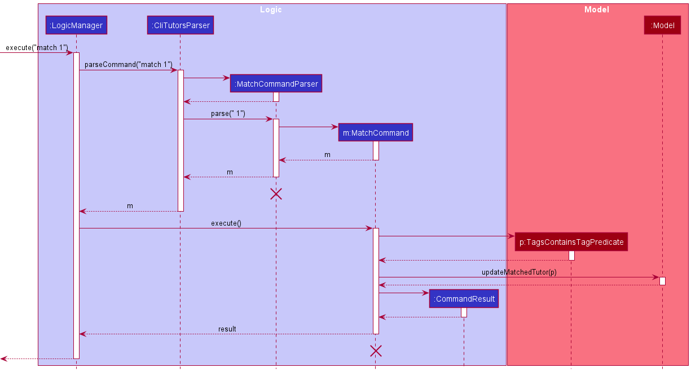
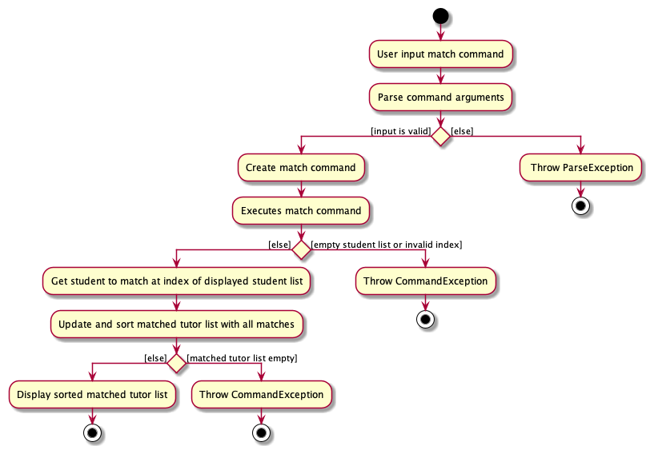

  

  

# CLITutors Developer Guide (v1.3)

## Table of Contents
{: .no_toc}
1. Table of Contents
{:toc}

**`CLITutors`** is a desktop app for **managing private tutoring jobs**, optimized for use via a **Command Line Interface (CLI)** while still having the benefits of a Graphical User Interface (GUI). If you have a big list of tutors to manage, `CLITutors` helps you to manage matching tutors and students for private tuition faster than using a regular database.

--------------------------------------------------------------------------------------------------------------------
## **Navigating this Developer Guide**
Before diving into the rest of the contents in our developer guide, the following are a few important syntaxes to take note of to facilitate your reading:

| Syntax                                                                  | Description                                         |
| ----------------------------------------------------------------------- | --------------------------------------------------- |
| `Markdown`                                                              | Denotes distinct classes, their methods or examples |
| 
:information_source: Note
 | Important things to take note of                    |
| <kbd>Keyboard</kbd>                                                     | Keyboard actions                                    |

--------------------------------------------------------------------------------------------------------------------
## **Setting up, getting started**

Refer to the guide [_Setting up and getting started_](SettingUp.md).

--------------------------------------------------------------------------------------------------------------------
## **Design**

 :bulb: **Tip:** The `.puml` files used to create diagrams in this document can be found in the [diagrams](https://github.com/AY2122S1-CS2103T-T17-2/tp/tree/master/docs/diagrams/) folder. Refer to the [_PlantUML Tutorial_ at se-edu/guides](https://se-education.org/guides/tutorials/plantUml.html) to learn how to create and edit diagrams.

### Architecture

The ***Architecture Diagram*** given above explains the high-level design of the App.

Given below is a quick overview of the main components and how they interact with each other.

**Main components of the architecture**

**`Main`** has two classes called [`Main`](https://github.com/AY2122S1-CS2103T-T17-2/tp/blob/master/src/main/java/seedu/address/Main.java) and [`MainApp`](https://github.com/AY2122S1-CS2103T-T17-2/tp/blob/master/src/main/java/seedu/address/MainApp.java). It is responsible for:
* At app launch: Initializes the components in the correct sequence, and connects them up with each other.
* At shut down: Shuts down the components and invokes cleanup methods where necessary.

[**`Commons`**](#common-classes) represents a collection of classes used by multiple other components.

The rest of the App consists of four components.

* [**`UI`**](#ui-component): The UI of the App.
* [**`Logic`**](#logic-component): The command executor.
* [**`Model`**](#model-component): Holds the data of the App in memory.
* [**`Storage`**](#storage-component): Reads data from and writes data to the hard disk.

Each of the four components,

* defines its *API* in an `interface` with the same name as the Component.
* exposes its functionality using a concrete `{Component Name}Manager` class (which implements the corresponding API `interface` mentioned in the previous point.

For example, the `Logic` component (see the class diagram given below) defines its API in the `Logic.java` interface and exposes its functionality using the `LogicManager.java` class which implements the `Logic` interface.

**How the architecture components interact with each other**

The *Sequence Diagram* below shows how the components interact with each other for the scenario where the user issues the command `delete s 1`.

The sections on the next few pages will give more details of each component.

### UI component
**API** : [`Ui.java`](https://github.com/AY2122S1-CS2103T-T17-2/tp/blob/master/src/main/java/seedu/address/ui/Ui.java)

Here's a class diagram of the `UI` component:

The UI consists of a `MainWindow` that is made up of parts e.g.`CommandBox`, `ResultDisplay`, `PersonListPanel`, `StatusBarFooter` etc.
All these, including the `MainWindow`, inherit from the abstract `UiPart` class which captures the commonalities
between classes that represent parts of the visible GUI.
The `PersonListPanel` is split up into `TutorCard` and `StudentCard` on the UI as 3 lists: Tutor List, Student List, and Match List (containing Tutor entries only).

The `UI` component uses the JavaFx UI framework. The layout of these UI parts is defined in matching `.fxml` files that are in the `src/main/resources/view` folder. For example, the layout of the [`MainWindow`](https://github.com/AY2122S1-CS2103T-T17-2/tp/blob/master/src/main/java/seedu/address/ui/MainWindow.java) is specified in [`MainWindow.fxml`](https://github.com/AY2122S1-CS2103T-T17-2/tp/blob/master/src/main/resources/view/MainWindow.fxml)

The `UI` component,

* executes user commands using the `Logic` component.
* listens for changes to `Model` data so that the UI can be updated with the modified data.
* keeps a reference to the `Logic` component, because the `UI` relies on the `Logic` to execute commands.
* depends on some classes in the `Model` component, as it displays `Person` object residing in the `Model`.

### Logic component

**API** : [`Logic.java`](https://github.com/AY2122S1-CS2103T-T17-2/tp/blob/master/src/main/java/seedu/address/logic/Logic.java)

Here's a (partial) class diagram of the `Logic` component:

How the `Logic` component works:
1. When `Logic` is called upon to execute a command, it uses the `AddressBookParser` class to parse the user command.
2. This results in a `Command` object (more precisely, an object of one of its subclasses e.g., `AddCommand`) which is executed by the `LogicManager`.
3. The command can communicate with the `Model` when it is executed (e.g. to add a person).
4. The result of the command execution is encapsulated as a `CommandResult` object which is returned back from `Logic`.

The Sequence Diagram below illustrates the interactions within the `Logic` component for the `execute("delete t 1")` API call.

Taking a deeper look into the classes in `Logic` that are used for parsing a user command:

How the parsing works:
* When called upon to parse a user command, the `AddressBookParser` class creates an `XYZCommandParser` (`XYZ` is a placeholder for the specific command name e.g., `AddCommandParser`) which uses the other classes shown above to parse the user command and create an `XYZCommand` object (e.g., `AddCommand`) which the `AddressBookParser` returns back as a `Command` object.
* All `XYZCommandParser` classes (e.g., `AddCommandParser`, `DeleteCommandParser`, ...) inherit the `Parser` interface so that they can be treated similarly where possible e.g, during testing.

### Model component
**API** : [`Model.java`](https://github.com/AY2122S1-CS2103T-T17-2/tp/blob/master/src/main/java/seedu/address/model/Model.java)

Here's a class diagram of the `Model` component:

The `Model` component,

* stores the address book data i.e., all `Tutor` and `Student` objects (which are contained in a `UniqueTutorList` and `UniqueStudentList` object respectively).
* stores the currently 'selected' `Tutor` and `Student` objects (e.g., results of a search query) as a separate _filtered_ list which is exposed to outsiders as an unmodifiable `ObservableList<Tutor>` and `ObservableList<Student>` respectively that can be 'observed' e.g. the UI can be bound to this list so that the UI automatically updates when the data in the list change.
* stores a `UserPref` object that represents the user’s preferences. This is exposed to the outside as a `ReadOnlyUserPref` object.
* does not depend on any of the other three components (as the `Model` represents data entities of the domain, they should make sense on their own without depending on other components)

:information_source: **Note:** An alternative (arguably, a more OOP) model is given below. It has a `Tag` list in the `AddressBook`, which `Tutor` and `Student` references. This allows `AddressBook` to only require one `Tag` object per unique tag, instead of each `Tutor` and `Student` needing their own `Tag` objects. 

### Storage component
**API** : [`Storage.java`](https://github.com/AY2122S1-CS2103T-T17-2/tp/blob/master/src/main/java/seedu/address/storage/Storage.java)

Here's a class diagram of the `Storage` component:

The `Storage` component,
* can save both address book data and user preference data in JSON format, and read them back into corresponding objects.
* inherits from both `AddressBookStorage` and `UserPrefStorage`, which means it can be treated as either one (if only the functionality of only one is needed).
* depends on some classes in the `Model` component (because the `Storage` component's job is to save/retrieve objects that belong to the `Model`)

### Common classes

Classes used by multiple components are in the `seedu.addressbook.commons` package.

--------------------------------------------------------------------------------------------------------------------
## **Implementation**

This section describes some noteworthy details on how certain features are implemented.

### Add feature

#### What it is

Adds a tutor or student to the tutor or student list respectively. The `add` command must have all the fields required for student and tutor.
#### Implementation details

##### Sequence of action
{:.no_toc}

Given below is an example usage scenario and how the `add` command implementation behaves at each step:

1. The user input (for e.g `"add t n/Jonathan Chan p/92102339 g/M q/2 t/PM SM"`) is handled by the `CommandBox` class in the Ui component, before being passed to `LogicManager` to be executed.
2. `LogicManager` calls on `AddressBookParser`'s `parseCommand()` method which in turns creates a new `AddCommandParser`.
3. The `AddCommandParser` calls its own `parse()` method which will return a new `AddCommand` if the input is valid.
4. `AddCommand` will then update the tutor list using the method `model#addTutor()` in the `Model` class.
5. Lastly, a new `CommandResult` with the success message is returned to the `LogicManager`.

Given below is a sequence diagram to show how the `add` implementation works:

Given below is an activity diagram to show how the `add` command works:

#### Design Considerations:

##### Aspect: How `add` executes

- **Alternative 1 (current choice)**: User must `add` using all the required prefixes.
    - Pros: It prevents the potential matching of tutors and students to have missing fields that are required when matching.
    - Cons: It is troublesome to type everything in at once.
- **Alternative 2**: User can add the tutor/student in multiple increments.
    - Pros: Simpler for the user to add details to the tutor or student.
    - Cons: Will cause many potential errors if there are missing fields required when matching them.

### Delete feature
#### What it is
Deletes the tutor or student at the specified `INDEX` from the displayed tutor/student list.

#### Implementation details
Similar to the `AddCommand` class above, the `DeleteCommand` class extends the `Command` class. The actual execution of the `delete` command is similar to that of the `add` command, except the `delete` command decides on the tutor/student to delete based on the `INDEX` of the tutor/student displayed on the `filteredTutors` list or the `filteredStudents` list of the `ModelManager` class.

##### Sequence of action
{:.no_toc}

Given below is an example usage scenario and how the `delete` command implementation behaves at each step:

1. The user input `delete t 1` is passed to `LogicManager` to be executed.
2. The `LogicManager` calls `AddressBookParser#parseCommand` to parse the given user input.
3. The `AddressBookParser` identifies the `delete` command and creates a new `DeleteCommandParser` object. It then calls `DeleteCommandParser#parse` with the command arguments as the parameter.
4. `DeleteCommandParser` then generates a `DeleteCommand` object with the `INDEX` (of the tutor/student to be deleted) and `PersonType` as parameters.
5. As the `PersonType` is a tutor, `DeleteCommand` retrieves the `Tutor` (to be deleted) from the `filteredTutors` list of the `ModelManager`. `DeleteCommand` will then call `Model#deleteTutor`, which will delete the tutor from the tutor list.
6. Lastly, a new `CommandResult` with the success message is returned to the `LogicManager`.

Given below is a sequence diagram to show how the `delete` implementation works for a **valid** `delete` tutor input:

Given below is an activity diagram to show how the `delete` command works for a `delete` tutor input:

#### Design Considerations
##### Aspect: How `delete` is executed
{:.no_toc}

- **Alternative 1 (current choice)**: User can `delete` only one tutor/student at a time.
    - Pros: Reduces the lack of potential errors due to the decreased complexity of the code. It is also easier to implement since there are lesser use cases to consider.
    - Cons: It is more troublesome for the user if they want to delete a range of tutors/students as they are now limited by having to `delete` each tutor/student one by one.

 :information_source: **Note:** In our current implementation, users can delete all tutors/students from their respective lists using the `clear` command. This is to make the app more intuitive for users with clear goals on the command they want to execute while reducing any unnecessary complexity in our `delete` command.

- **Alternative 2**: User can `delete` multiple tutors/students using the command at the same time.
    - Pros: Allows the user more flexibility in deleting tutors/students instead of just deleting them one by one.
      For example, users can choose to `delete` one or many tutors/students, depending on their command input.
    - Cons: This will cause the code to become more complex in dealing with many possible inputs and scenarios, leading to a higher amount of potential errors.

### Edit feature
#### What it is
Edits a tutor/student in the tutor/student list respectively. All fields are **optional** in the `edit` command, but **at least one field** must be specified for the command to execute successfully.

#### Implementation details
##### Sequence of action
{: .no_toc}

Given below is an example usage scenario and how the `edit` command implementation behaves at each step:

1. The user input `edit t 1 p/94203825` is passed to `LogicManager` to be executed.
2. `LogicManager` calls `AddressBookParser#parseCommand` which in turn creates a new `EditCommandParser`.
3. The `EditCommandParser` calls its own `parse()` method which will return a new `EditCommand` if the input is valid.
4. `EditCommand` will then update the tutor list in the `Model` class by replacing the existing tutor (to be edited) with the edited tutor.
5. Lastly, a new `CommandResult` with the success message is returned to the `LogicManager`.

Given below is a sequence diagram to show how the `edit` implementation works for a **valid** `edit` tutor input:

Given below is an activity diagram to show how the `edit` command works on a tutor:

#### Design Considerations
##### Aspect: How `edit` executes
{: .no_toc}

- **Alternative 1 (current choice)**: `edit` is handled separately for tutors and students via `EditTutorDescriptor` and `EditStudentDescriptor` respectively.
    - Pros: It allows the user to edit the details of tutors/students even if they have different fields.
    - Cons: `EditCommandParser` would be more complex since it has to handle edits for tutors and students separately due to differing requirements. The higher complexity may lead to a higher chance of creating bugs.
- **Alternative 2**: `edit` is handled using `EditPersonDescriptor` for both tutors and students.
    - Pros: Simpler to implement and maintain since changes to `EditPersonDescriptor` will be propagated to both tutors and students when editing them.
    - Cons: Prevents custom fields that a `Tutor` should have but a `Student` should not, or vice-versa. A `Tutor` and `Student` must have the same attributes for this implementation to work, and is hence not extensible should `Tutor` and `Student` be required to contain a different set of attributes.

### List feature
#### What it is

Lists all tutors or students in the list. The `list` command only accepts `s` or `t` as a parameter
#### Implementation details

##### Sequence of action
{:.no_toc}

Given below is an example usage scenario and how the `list` command implementation behaves at each step:

1. The user input (for e.g `"list s"`) is handled by the `CommandBox` class in the Ui component, before being passed to `LogicManager` to be executed.
2. `LogicManager` calls on `AddressBookParser`'s `parseCommand()` method which in turns creates a new `ListCommandParser`.
3. The `ListCommandParser` calls its own `parse()` method which will return a new `ListCommand` if the input is valid.
4. `ListCommand` will then show all students in the student list in the `Model` class.
5. Lastly, a new `CommandResult` with the success message is returned to the `LogicManager`.

Given below is a sequence diagram to show how the `list` implementation works:

Given below is an activity diagram to show how the `list` command works:

#### Design Considerations:

##### Aspect: How `list` executes

- **Alternative 1 (current choice)**: User must specify which list that they would like to see.
    - Pros: It allows the user to not remove any filters they have on the other list.
    - Cons: It is troublesome to type the command twice if the user wanted to view all the tutors and students.
- **Alternative 2**: User inputs `list` and all tutors and student are shown.
    - Pros: Simpler for the user to input.
    - Cons: Will remove any filters they had on a list that they did not want to remove and show all the students/tutors.

### Find feature

#### What it is

Searches and displays all tutors/students that matches the parameters specified. The `find` command must have **at least one parameter** specified to be valid (i.e. `find s NOT_A_PARAMETER` will **not** work).

#### Implementation details

A noteworthy change in implementation of our `FindCommand` from the standard AB3 `FindCommand` is in `FindCommandParser`. We expanded on the `FindCommand` functionality such that it can find for students/tutors  multiple attributes. Because of this, we opted to create a new `ChainedPredicate` class that encapsulates the idea of chaining multiple predicates together. Each attribute specified by the user creates its own predicate which is then chained together using the `Predicate#and` method and the resulting predicate is then stored in the `ChainedPredicate` class.

##### Sequence of action
{:.no_toc}

Given below is an example usage scenario and how the `find` command implementation behaves at each step:

1. The user input `find s n/David` is passed to `LogicManager` to be executed.
2. `LogicManager` calls on `AddressBookParser#parseCommand` method which creates a new `FindCommandParser`.
3. The `FindCommandParser` then calls its own `parse()` method which will return a new `FindCommand` if the input is valid.
4. `LogicManager` will execute the `FindCommand` through `FindCommand#execute`.
5. `FindCommand` will then search and update the student list in the `Model` class using the `Model#updateFilteredStudentList` method.
6. Lastly, a new `CommandResult` with the success message is returned to the `LogicManager`.

Given below is a sequence diagram to show how a **valid** `find` implementation works for a `find` student input:

Given below is an activity diagram to show how a `find` implementation works for a `find` student input:

#### Design Considerations

##### Aspect: How `find` is executed
{:.no_toc}

- **Alternative 1 (current choice)**: User can `find` using multiple prefixes at once.
  - Pros: It allows the user to find tutor/student more easily by their fields.
  (for e.g. they can find all tutors who are women and teaches Primary Math)
  - Cons: It would be more complex since it has to parse multiple prefixes and chain predicates together depending on the user input. The higher complexity may lead to a higher chance of creating bugs.
- **Alternative 2**: User can only `find` using one prefix at a time.
  - Pros: Simpler to implement since there are lesser use cases to consider and hence, making the code less prone to bugs.
  - Cons: Significant impact on the overall user experience since finding a person with only one prefix may generate a large list if there are many tutors/students stored. user may not be able to find what he/she specifically wants.

### Match feature

#### What it is

The Match feature involves taking a student specified by the user and matching the student with tutors who have **one or more** matching tags with the identified student. It automatically sorts the `matchedTutorList` according to the number of matching tags that a tutor has with the student.

#### Implementation details
Upon the user's entry of the command, the validity of the user's input is checked. If the input is valid, a `MatchCommand` object is created. `MatchCommand` is a class that extends the `Command` abstract class, with `MatchCommand` implementing the `execute()` method. Upon execution, the student is identified via the `INDEX` given by the user and a `TagsContainTagPredicate` object is created, which will be used to determine if the `tags` of the tutor contains one or more `Tag` that the student has. It will then update and sort the `matchedTutorList` such that the tutor with more matching `Tag` is at the front of the list.

##### Sequence of action
{:.no_toc}
Given below is an example valid usage scenario and how the `match` command implementation behaves at each step. 

**Prerequisite**: There are students in the student list and there are tutors which have `tags` that the student has (i.e. there are matches available for the student).

Steps:
1. The user input `match 1` (i.e. match the first student in the student list) is passed to `LogicManager` to be executed.
2. `LogicManager` calls on `AddressBookParser#parseCommand`, which creates a new `MatchCommandParser` object.
3. The `MatchCommandParser` object calls on its own parse() method which will validate the user input and return a new `MatchCommand`.
4. `LogicManager` will execute the `MatchCommand` through `MatchCommand#execute`, which will be responsible for matching the `Student`.
5. `MatchCommand` will find the first student in the student list and a `TagsContainTagPredicate` object is created.
6. The `matchTutorList` in the `Model` will then be updated via `Model#updateMatchedTutor`.
7. Lastly, a new `CommandResult` with the success message is returned to the `LogicManager`.

Given below is a sequence diagram to show how the `match` implementation works for a **valid** `match` input:

Given below is an activity diagram to show how the `match` command works for a `match` input:

#### Design Considerations

##### Aspect: How `match` is executed
{:.no_toc}
- **Alternative 1 (current choice)**: User can `match` students with multiple `tags` to tutors.
    - Pros: It prevents the user from having to create one `Student` object for every subject that the student is looking for, which allows the database to store lesser unnecessary/duplicate information about the student, making it less prone to bugs.
    - Cons: The code will become more complex as there is a need to create a `TagsContainTagPredicate` to assist in finding all the relevant matching tutors.
- **Alternative 2**: User can `match` students with only one `Tag` to tutors.
    - Pros: Simpler implementation which requires a less complex predicate, making it easier for developers to understand the code.
    - Cons: Higher storage cost due to more `Student` objects being created if a specific student wants to learn multiple subjects as students are only limited to one `Tag`.

### Filter feature

#### What it is

Filters and displays all tutors for the match list that matches the parameters specified. The `filter` command must have **at least one parameter** specified to be valid (i.e. `filter t NOT_A_PARAMETER` will **not** work).

#### Implementation details

The `FilterCommand` just like the `FindCommand` makes use of the `ChainedPredicate` class to chain multiple predicates together to filter the list of matched tutors.

##### Sequence of action
{:.no_toc}

Given below is an example usage scenario and how the `filter` command implementation behaves at each step:

1. The user input `filter t q/3` is passed to `LogicManager` to be executed.
2. `LogicManager` calls on `AddressBookParser#parseCommand` method which creates a new `FilterCommandParser`.
3. The `FilterCommandParser` then calls its own `parse()` method which will return a new `FilterCommand` if the input is valid.
4. `LogicManager` will execute the `FilterCommand` through `FilterCommand#execute`.
5. The `matchTutorList` in the `Model` will be updated via `Model#updateMatchedTutor`.
6. Lastly, a new `CommandResult` with the success message is returned to the `LogicManager`.

Given below is a sequence diagram to show how a **valid** `filter` implementation works for a `filter` input:

Given below is an activity diagram to show how a `find` implementation works for a `filter` input:

#### Design Considerations

##### Aspect: How `find` is executed
{:.no_toc}

- **Alternative 1 (current choice)**: User can `find` using multiple prefixes at once.
    - Pros: It allows the user to find tutor/student more easily by their fields.
       (for e.g. they can find all tutors who are women and teaches Primary Math)
    - Cons: It would be more complex since it has to parse multiple prefixes and chain predicates together depending on the user input. The higher complexity may lead to a higher chance of creating bugs.
- **Alternative 2**: User can only `find` using one prefix at a time.
    - Pros: Simpler to implement since there are lesser use cases to consider and hence, making the code less prone to bugs.
    - Cons: Significant impact on the overall user experience since finding a person with only one prefix may generate a large list if there are many tutors/students stored. user may not be able to find what he/she specifically wants.

--------------------------------------------------------------------------------------------------------------------
## **Documentation, logging, testing, configuration, dev-ops**

* [Documentation guide](Documentation.md)
* [Testing guide](Testing.md)
* [Logging guide](Logging.md)
* [Configuration guide](Configuration.md)
* [DevOps guide](DevOps.md)

--------------------------------------------------------------------------------------------------------------------
## **Appendix: Requirements**

### Product scope

#### Target user profile

* Has a need to manage a significant number of private tutors and students
* Likes a lightweight tutor management application to reduce *bloatware*
* Wants to have a platform to match students to private tutors
* Prefers desktop app over other platforms
* Can type fast
* Prefers typing to mouse interactions
* Is comfortable with using a CLI

#### Value Proposition

Manage the matching of tutors and students for teaching jobs more efficiently than a regular GUI-driven application.

### User Stories

Priorities: High (must have) - `* * *`, Medium (nice to have) - `* *`, Low (unlikely to have) - `*`

| Priority | As a ...                                       | I want to ...                                         | So that I can …                                                   |
| -------- | ---------------------------------------------- | ----------------------------------------------------- | ----------------------------------------------------------------- |
| `* * *`  | new user ready to adopt the app for my own use | purge all data                                        | clear all dummy data and begin to use the app                     |
| `* * *`  | user                                           | delete students and tutors from the list              | remove those people who do not use the service anymore            |
| `* * *`  | user                                           | add new students and tutors to the app                |                                                                   |
| `* * *`  | user                                           | view my saved data                                    | recall the information of my tutors/students                      |
| `* * *`  | user                                           | find people that match some keywords                  | avoid scrolling through thousands of entries of data              |
| `* * *`  | user                                           | assign tags to tutors and students                    | categorize them by their needs                                    |
| `* * *`  | user                                           | match students and tutors according to their needs    |                                                                   |
| `* * *`  | user                                           | To get feedback from the system                       | see if my commands are working                                    |
| `* * *`  | user                                           | type the commands I want to execute                   |                                                                   |
| `* * *`  | busy user                                      | use shorter commands                                  | save time keying in full commands                                 |
| `* *`    | first-time user                                | see some sample data when I open the app              | easily try out the features without needing to add my data first  |
| `* *`    | clumsy user                                    | have a safety net                                     | avoid purging my data by accident                                 |
| `* *`    | user                                           | edit personal details                                 | update any new particulars of the tutors/students                 |
| `* *`    | user                                           | sort by tags                                          | easily find groups of people with the same tags                   |
| `* *`    | forgetful user                                 | see the available commands for the program            | know what tasks I can do with the program                         |
| `* *`    | user                                           | search students and tutors by tags                    | easily import data from one machine to another                    |
| `* *`    | user                                           | load in pre-existing data                             | save time keying in full commands                                 |
| `* *`    | user                                           | assign ratings to tutors                              | see how well their ratings are when teaching students             |
| `* *`    | user                                           | undo my commands made                                 | retrieve the previous state of data if I’ve made a mistake        |
| `* *`    | user                                           | add priority for matching certain tutors and students | schedule urgent cases ahead of other cases for greater efficiency |
| `*`      | user                                           | be able to go through the history of my command       | avoid reentering frequently used commands                         |
| `*`      | user                                           | save pictures of students and tutors                  | match faces to names                                              |
| `*`      | first-time user                                | view an interactive tutorial                          | learn how to use the app                                          |

### Use Cases

(For all use cases below, the System is the `CLITutorsBook` and the Actor is the User, unless otherwise specified)

#### Use case (UC01): Add a Tutor
{:.no_toc}

**MSS**

1. User keys in the tutor's details
2. Tutor is added to the database
    Use case ends.

**Extensions**

* 1a. User keys in an incorrect format.
    * 1a1. System displays an error message to tell the user about the format error.
       Use case ends.

#### Use case (UC02): Add a Student
{:.no_toc}

**MSS**

1. User keys in the student's details
2. Student is added to the database
    Use case ends.

**Extensions**

* 1a. User keys in an incorrect format.
    * 1a1. System displays an error message to tell the user about the format error.
       Use case ends.

#### Use case (UC03): Edit a Student name
{:.no_toc}

**MSS**

1. User enters the command to edit the name of Student A
2. System replies with a confirmation message that the edit is successful
    Use case ends.

**Extensions**

* 1a. User wants to <ins>edit the phone number (UC04)</ins> of Student A.
   Use case ends.
* 2a. User keys in an incorrect prefix for editing name.
    * 2a1. System displays an error message to tell the user about the format error.
       Use case ends.

#### Use case (UC04): Edit a Student phone number
{:.no_toc}

**MSS**

1. User enters the command to edit the phone number of Student B
2. System replies with a confirmation message that the edit is successful
    Use case ends.

**Extensions**

* 1a. User wants to <ins>edit the name (UC03)</ins> of Student B.
   Use case ends.
* 2a. User keys in an incorrect prefix for editing the phone number.
    * 2a1. System displays an error message to tell the user about the format error.
       Use case ends.

#### Use case (UC05): Delete a Tutor
{:.no_toc}

**MSS**

1. User requests to list tutors
2. `CLITutorsBook` shows a list of tutors
3. User requests to delete a specific tutor in the list
4. `CLITutorsBook` deletes the tutor
    Use case ends.

**Extensions**

* 2a. The list is empty.
   Use case ends.
* 3a. The given index is invalid.
    * 3a1. `CLITutorsBook` shows an error message.
       Use case resumes at step 2.

#### Use case (UC06): Delete a Student
{:.no_toc}

**MSS**

1. User requests to list students
2. `CLITutorsBook` shows a list of students
3. User requests to delete a specific student from the list
4. `CLITutorsBook` deletes the student
    Use case ends.

**Extensions**

* 2a. The list is empty.
   Use case ends.
* 3a. The given index is invalid.
    * 3a1. `CLITutorsBook` shows an error message.
       Use case resumes at step 2.

#### Use case (UC07): Find a Tutor
{:.no_toc}

**MSS**

1. User requests to find a tutor using his/her name
2. `CLITutorsBook` shows all tutors that contain that specific name
    Use case ends.

**Extensions**

* 1a. The list is empty.
   Use case ends.
* 1b. There is no one with that specific name.
   Use case ends.

#### Use case (UC08): Find a Student
{:.no_toc}

**MSS**

1. User requests to find a student using his/her name
2. `CLITutorsBook` shows all students that contain that specific name
    Use case ends.

**Extensions**

* 1a. The list is empty.
   Use case ends.
* 1b. There is no one with that specific name.
   Use case ends.

#### Use case (UC09): Match a student with the tutors
{:.no_toc}

**MSS**

1. User requests to match a student with tutors with the required qualifications
2. `CLITutorsBook` shows the tutors that are able to match with the specified student in a window
    Use case ends.

**Extensions**

* 1a. There are no tutors that match the requirements of the student.
   Use case ends.

### Non-Functional Requirements

1. Should work on any *mainstream OS* as long as it has Java 11 or above installed.
2. Should be able to run on both 32-bit and 64-bit systems.
3. Should be able to hold up to 1000 persons without a noticeable sluggishness in performance for typical usage.
4. Should not require the use of remote databases.
5. System should be able to run even if the data file has errors arising from a user manually editing it.
6. Response to user commands (add, delete, edit, match) should be visible within 2 seconds.
7. A user with above-average typing speed for regular English text (i.e. not code, not system admin commands) should be able to accomplish most of the tasks faster using commands than using the mouse.
8. The system should be usable by a novice who may not be familiar with CLI. i.e. Users are not expected to key in complicated commands to get desired outputs.
9. Product should not be able to send out any information to the student
10. Product should not be able to verify the legitimacy of the information of the student or private tutor.

### Glossary

| Term              | Meaning                                                                                                                                           |
|:----------------- |:------------------------------------------------------------------------------------------------------------------------------------------------- |
| **CLI**           | Command-Line Interface                                                                                                                            |
| **JSON**          | JSON stands for ***JavaScript Object Notation*** which is a lightweight format for data storage                                                   |
| **Mainstream OS** | Windows, macOS, Linux                                                                                                                             |
| **Index**         | Index number shown in the displayed list. The index must be a positive integer 1, 2, 3, …                                                         |
| **Qualification** | How qualified the tutor is with regards to these levels: 0.Pre-University 1.University Student 2.Post-Grad 3.MOE-Trained              |
| **Tag**           | Subjects each Tutor teaches are saved under tags as ``[X][Y]`` (X is Level code and Y is Specific Subject code). eg. `PM` stands for Primary Math.|
| **Bloatware**     | Software that uses excessive memory and disk space, which makes the program run slow                                                              |
--------------------------------------------------------------------------------------------------------------------
## **Appendix: Instructions for Manual Testing**

to be added...
