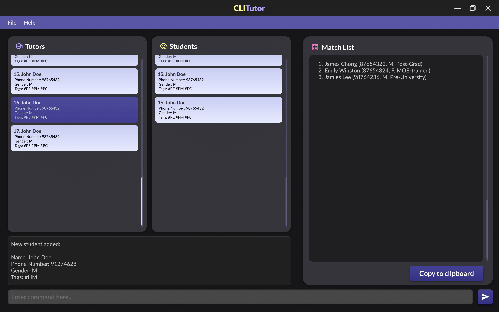

**`CLITutors`** is a desktop app for **managing private tutoring jobs**, optimized for use via a **Command Line Interface (CLI)** while still having the benefits of a Graphical User Interface (GUI). If you have a big list of tutors to manage, `CLITutors` helps you to manage matching tutors and students for private tuition faster than using a regular database.

The application supports the following level of education and subjects as shown in table below.

<table>
    <thead>
        <tr>
            <th style="text-align:center; padding: 10px">Education Level</th>
            <th style="text-align:center">Subjects</th>
            <th style="text-align:center">Tag</th>
        </tr>
    </thead>
    <tbody>
        <tr>
            <td rowspan=3><b>P</b>rimary</td>
            <td><b>E</b>nglish</td>
            <td style="text-align:center"><b>PE</b></td>
        </tr>
        <tr>
            <td><b>M</b>ath</td>
            <td style="text-align:center"><b>PM</b></td>
        </tr>
        <tr>
            <td><b>S</b>cience</td>
            <td style="text-align:center"><b>PS</b></td>
        </tr>
        <tr>
        <td rowspan=8><b>S</b>econdary</td>
            <td><b>B</b>iology</td>
            <td style="text-align:center"><b>SB</b></td>
        </tr>
        <tr>
            <td><b>C</b>hemistry</td>
            <td style="text-align:center"><b>SC</b></td>
        </tr>
        <tr>
            <td><b>E</b>nglish</td>
            <td style="text-align:center"><b>SE</b></td>
        </tr>
        <tr>
            <td><b>G</b>eography</td>
            <td style="text-align:center"><b>SG</b></td>
        </tr>
        <tr>
            <td><b>H</b>istory</td>
            <td style="text-align:center"><b>SH</b></td>
        </tr>
        <tr>
            <td><b>L</b>iterature</td>
            <td style="text-align:center"><b>SL</b></td>
        </tr>
        <tr>
            <td><b>M</b>ath</td>
            <td style="text-align:center"><b>SM</b></td>
        </tr>
        <tr>
            <td><b>P</b>hysics</td>
            <td style="text-align:center"><b>SP</b></td>
        </tr>
        <tr>
            <td rowspan=8><b>T</b>ertiary</td>
            <td><b>B</b>iology</td>
            <td style="text-align:center"><b>TB</b></td>
        </tr>
        <tr>
            <td><b>C</b>hemistry</td>
            <td style="text-align:center"><b>TC</b></td>
        </tr>
        <tr>
            <td><b>E</b>conomics</td>
            <td style="text-align:center"><b>TE</b></td>
        </tr>
        <tr>
            <td><b>G</b>eography</td>
            <td style="text-align:center"><b>TG</b></td>
        </tr>
        <tr>
            <td><b>H</b>istory</td>
            <td style="text-align:center"><b>TH</b></td>
        </tr>
        <tr>
            <td><b>L</b>iterature</td>
            <td style="text-align:center"><b>TL</b></td>
        </tr>
        <tr>
            <td><b>M</b>ath</td>
            <td style="text-align:center"><b>TM</b></td>
        </tr>
        <tr>
            <td><b>P</b>hysics</td>
            <td style="text-align:center"><b>TP</b></td>
        </tr>
    </tbody>
</table>

`Tag` is dervived from [**LEVEL**][**SUBJECT**] e.g. **PM** is Primary Math.

Here are the possible categories of qualifications for tutors:

- Qualifications
    - `0`: Pre-University
    - `1`: University Student
    - `2`: Post-Grad
    - `3`: MOE-Trained

## Table of Contents
* Table of Contents
{:toc}

## Quick start

1. Ensure you have Java `11` or above installed in your Computer.
2. Download the latest `CLITutors.jar` from [here](https://github.com/AY2122S1-CS2103T-T17-2/tp).
3. Copy the file to the folder you want to use as the *home folder* for your AddressBook.
4. Double-click the file to start the app. The GUI similar to the below should appear in a few seconds. Note how the app contains some sample data.
   
5. Type the command in the command box and press `Enter` to execute it. e.g. typing `ihelp` and pressing `Enter` will open the interactive tutorial done by Zi Hao. Some example commands you can try:
    - `list`: lists all tutors and students
    - `help`: shows all commands available
    - `add`: add a tutor/student to the program
    - `delete`: delete a tutor/student from the program
    - `edit`: edit details of a tutor/student
    - `find`: find a tutor/student matching a given keyword
    - `clear`: clears all entries
    - `exit`: exits the program
6. Refer to the [Features](#Features) below for details of each command.

## Features

<b>:information_source: Notes about the command format:</b> 

- Words in `UPPER_CASE` are the parameters to be supplied by the user. 
  e.g. in `add n/NAME`, `NAME` is a parameter which can be used as `add n/John Doe`.

- Items in square brackets are optional. 
  e.g `n/NAME [t/TAG]` can be used as `n/John Doe t/friend` or as `n/John Doe`.

- Items with `…` after them can have multiple arguments in them. 
  e.g. `[t/TAG...]` can be used as `t/PM` or `t/PM PC PB` etc.

- If a parameter is expected only once in the command but you specified it multiple times, only the last occurrence of the parameter will be taken. 
  e.g. if you specify `p/12341234 p/56785678`, only `p/56785678` will be taken.

- Extraneous parameters for commands that do not take in parameters (such as `help`, `list`, `exit` and `clear`) will be ignored. 
  e.g. if the command specifies `help 123`, it will be interpreted as `help`.

- Tags are denoted by `t/[Level][Subject]`.  
  e.g. The tag t/PM stands for Primary Math.

- Editing information of any `Person` will override the current information stored about the specified `Person`.

- Commands with `t` modify attributes of tutors while commands with `s` modify attributes of students. 
  e.g `delete t 1` stands for deleting the tutor at index `1` in the list of tutors.

### Viewing help: `help`

Shows a message with all the commands available to use on `CLITutors`.

### Adding a tutor/student: `add`

Adds a tutor/student to the data.

Format: 
`add t n/NAME p/PHONE_NUMBER g/GENDER q/QUALIFICATIONS t/TAG...` 
`add s n/NAME p/PHONE_NUMBER g/GENDER t/TAG`

Examples: 
`add t n/John Doe p/98765432 g/M q/2 t/PM TE TM TL` 
`add s n/Mary Sue p/98765432 g/F t/PM`

### Editing a tutor/student: `edit`

Edits an existing tutor/student in the data.

Format: 
`edit t INDEX [n/NAME] [p/PHONE_NUMBER] [g/GENDER] [q/QUALIFICATIONS] [t/TAG]...`
`edit s INDEX [n/NAME] [p/PHONE_NUMBER] [g/GENDER] [t/TAG]`

* Edits the tutor/student at the specified `INDEX`. The index refers to the index number shown in the displayed tutor/student list. The index **must be a positive integer** 1, 2, 3, …​
* At least one of the optional fields must be provided.
* Existing values will be updated to the input values.
* When editing tags, the existing tags of the tutor/student will be removed i.e adding of tags is not cumulative.
* You must specify at least one tag when editing the tags with `t/`.

Examples: 
`edit t n/John Doe q/2 t/PM TE TM TL` 
`edit s n/Mary Sue p/98765432`

### Deleting a tutor/student: `delete`

Deletes the specified tutor/student from the data.

Format: 
`delete t INDEX` 
`delete s INDEX`

- Deletes the tutor/student at the specified `INDEX`.
- The index refers to the index number shown on the tutor/student list.
- The index **must be a positive integer**, eg. `1`, `2`, `3`, ...

Examples: 
`list` followed by `delete t 2` deletes the 2nd person in the tutor list.  
`find n/Betsy` followed by `delete t 1` deletes the 1st person in the results of the find command for the tutor list.

### Editing a tutor/student's particulars: `edit`

Edits a tutor/student's personal particulars from the data.

Format: 
`edit t INDEX [n/NAME] [p/PHONE_NUMBER] [g/GENDER] [q/QUALIFICATIONS] [t/TAG...]` 
`edit s INDEX [n/NAME] [p/PHONE_NUMBER] [g/GENDER] [t/TAG]`

Example: 
`edit s 0 n/Karina Nabay g/F` to edit student.

### Listing all tutors/students: `list`

Shows the list of all tutors.

Format:  `list`

### Finding a tutor/student: `find`

Find a tutor/student by name.

Format:  
`find t n/NAME`  
`find s n/NAME`
- The search is case-insensitive. e.g. `n/hans` will match `Hans`
- Only the last name given is searched. e.g. `find t n/John n/Amy` will find names that match `Amy`
- Only full words will be matched e.g. `n/Han` will not match `Hans`, and `n/Han Solo` will not match `Han Dan`

Example: 
`find t n/John Cheese`

### Matching a student to tutor(s): `match`

Find tutor(s) who teaches the subject that the student wants.

Format:  `match INDEX`

Example: 
`match 1`

### Clearing all entries: `clear`

Clears all entries from storage.

Format:  `clear`

### Exiting the program: `exit`

Exits the program.

Format:  `exit`

### Saving the data

`CLITutors` data is saved in the hard disk automatically after any command that changes the data. There is no need to save manually.

### Editing the data file

`CLITutors` data is saved as 2 JSON files `[JAR file location]/data/addressbook.json`. Advanced users are welcome to update data directly by editing that data file.

❗<b>Caution:</b> If your changes to the data file makes its format invalid, `CLITutors` will discard all data and start with an empty data file at the next run.

## Command summary

|   Action   | Format, Examples |
|:----------:|:---------------- |
|  **Add**   | `add t n/NAME p/PHONE_NUMBER g/GENDER q/QUALIFICATIONS t/TAG...`  `add s n/NAME p/PHONE_NUMBER g/GENDER t/TAG`   e.g. `add t n/John Doe p/98765432 g/M q/3 t/PM`    |
| **Delete** | `delete t INDEX`   `delete s INDEX`   e.g. `delete s 3`                 |
|  **Help**  | `help`           |
|  **Edit**  | `edit t INDEX [n/NAME] [p/PHONE_NUMBER] [g/GENDER] [q/QUALIFICATIONS] [t/TAG...]`  `edit s INDEX [n/NAME] [p/PHONE_NUMBER] [g/GENDER] [t/TAG]`  e.g. `edit t 2 n/John Doe q/1`   |
|  **List**  | `list`           |
|  **Find**  | `find t n/NAME`   `find s n/NAME`   e.g. `find s n/John`  |
| **Match**  | `match INDEX`   e.g. `match 1`          |
| **Clear**  | `clear`          |
|  **Exit**  | `exit`           |

<!-- ## FAQ -->
