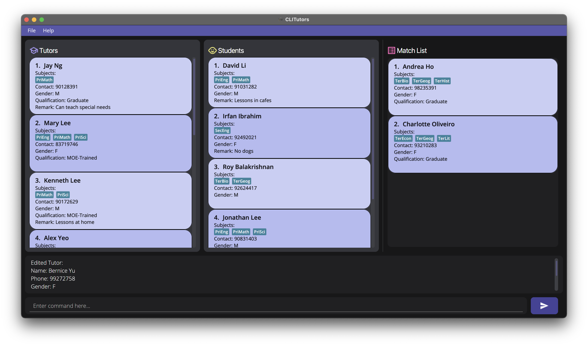

# {{CLI}}Tutors User Guide

**`{{CLI}}Tutors`** is a desktop app for **managing private tutoring jobs**, optimized for use via a **Command Line Interface (CLI)** while still having the benefits of a Graphical User Interface (GUI). If you have a big list of tutors to manage, `{{CLI}}Tutors` helps you to manage matching tutors and students for private tuition faster than using a regular database.

The application supports matching the following levels of education:

- **P**rimary
- **S**econdary
- **T**ertiary

And the following subjects:

- Math and Sciences
    - **P**hysics
    - **C**hemistry
    - **B**iology
    - **M**athematics

- Humanities
    - **H**istory
    - **G**eography
    - **L**iterature
    - **E**conomics

Here are the possible categories of qualifications for tutors:

- Qualifications
    - `0`: Pre-University
    - `1`: University Student
    - `2`: Post-Grad
    - `3`: MOE-Trained

## Table of Contents
- [Quick Start](#Quick-Start)
- [Features](#Features)
    - [Viewing help: `help`](#Viewing-help-help)
    - [Getting interactive help: `ihelp`](#Getting-interactive-help-ihelp)
    - [Adding a tutor/student: `add`](#Adding-a-tutorstudent-add)
    - [Deleting a tutor/student: `delete`](#Deleting-a-tutorstudent-delete)
    - [Editing a tutor/student's particulars: `edit`](#Editing-a-tutorstudent%E2%80%99s-particulars-edit)
    - [Listing all tutors/students: `list`](#Listing-all-tutorsstudents-list)
    - [Finding a tutor/student: `find`](#Finding-a-tutorstudent-find)
    - [Clearing all entries: `clear`](#Clearing-all-entries-clear)
    - [Exiting the program: `exit`](#Exiting-the-program-exit)
    - [Saving the data](#Saving-the-data)
    - [Editing the data file](#Editing-the-data-file)
- [Command summary](#Command-summary)
<!-- - [FAQ](#FAQ) -->

## Quick start

1. Ensure you have Java `11` or above installed in your Computer.
2. Download the latest `{{CLI}}Tutors.jar` from [here](https://github.com/AY2122S1-CS2103T-T17-2/tp).
3. Copy the file to the folder you want to use as the *home folder* for your AddressBook.
4. Double-click the file to start the app. The GUI similar to the below should appear in a few seconds. Note how the app contains some sample data.
   
5. Type the command in the command box and press `Enter` to execute it. e.g. typing `ihelp` and pressing `Enter` will open the interactive tutorial done by Zi Hao. Some example commands you can try:
    - `list`: lists all tutors and students
    - `help`: shows all commands available
    - `add`: add a tutor/student to the program
    - `delete`: delete a tutor/student from the program
    - `edit`: edit details of a tutor/student
    - `find`: find a tutor/student matching a given keyword
    - `clear`: clears all entries
    - `exit`: exits the program
6. Refer to the [Features](#Features) below for details of each command.

## Features

<b>:information_source: Notes about the command format:</b> 

- Words in `UPPER_CASE` are the parameters to be supplied by the user.
  e.g. in `add n/NAME`, `NAME` is a parameter which can be used as `add n/John Doe`.

- Items in square brackets are optional.
  e.g `n/NAME [t/TAG]` can be used as `n/John Doe t/friend` or as `n/John Doe`.

- Items with `…` after them can be used multiple times including zero times.
  e.g. `[t/TAG]…` can be used as ` ` (i.e. 0 times), `t/friend`, `t/friend t/family` etc.

- If a parameter is expected only once in the command but you specified it multiple times, only the last occurrence of the parameter will be taken.
  e.g. if you specify `p/12341234 p/56785678`, only `p/56785678` will be taken.

- Extraneous parameters for commands that do not take in parameters (such as `help`, `list`, `exit` and `clear`) will be ignored.
  e.g. if the command specifies `help 123`, it will be interpreted as `help`.

- Tags are denoted by t/[Level][Subject].
  e.g. The tag t/PM stands for Primary Math

- Commands with `t` modify attributes of tutors while commands with `s` modify attributes of students.
  e.g `delete t 1` stands for deleting the tutor at index `1` in the list of tutors

### Viewing help: `help`

Shows a message with all the commands available to use on `{{CLI}}Tutors`.

### Getting interactive help: `ihelp`

Starts the interactive tutorial done by Zi Hao to introduce new users to `{{CLI}}Tutors`.

### Adding a tutor/student: `add`

Adds a tutor/student to the data.

Format:
`add t n/NAME p/PHONE_NUMBER g/GENDER q/QUALIFICATIONS t/TAG...`
`add s n/NAME p/PHONE_NUMBER g/GENDER t/TAG`

Examples:
`add t n/John Doe p/98765432 g/M q/2 t/PM TE TM TL`
`add s n/Mary Sue p/98765432 g/F t/PM`

### Deleting a tutor/student: `delete`

Deletes the specified tutor/student from the data.

Format:
`delete t INDEX`
`delete s INDEX`

- Deletes the tutor/student at the specified INDEX.
- The index refers to the index number shown on the tutor/student list.
- The index **must be a positive integer** eg. 1, 2, 3, ...

Examples:
`delete t 0`
`delete s 5`

### Editing a tutor/student's particulars: `edit`

Edits a tutor/student's personal particulars from the data.

Format:
`edit INDEX [n/NAME] [p/PHONE_NUMBER] [g/GENDER] [q/QUALIFICATIONS] [t/TAG...]`

Example:
`edit 0 n/Karina Nabay g/F`

### Listing all tutors/students: `list`

Shows the list of all tutors.

Format: `list`

### Finding a tutor/student: `find`

Finds a tutor/student whose names or contact numbers contain any of the given keywords.

Format: `find KEYWORD`

Example:
`find Cheese`

### Clearing all entries: `clear`

Clears all entries from the database.

Format: `clear`

### Exiting the program: `exit`

Exits the program.

Format: `exit`

### Saving the data

`{{CLI}}Tutors` data is saved in the hard disk automatically after any command that changes the data. There is no need to save manually.

### Editing the data file

`{{CLI}}Tutors` data is saved as 2 JSON files `[JAR file location]/data/addressbook.json`. Advanced users are welcome to update data directly by editing that data file.

❗<b>Caution:</b> If your changes to the data file makes its format invalid, `{{CLI}}Tutors` will discard all data and start with an empty data file at the next run.

## Command summary

|   Action   | Format, Examples |
|:----------:|:---------------- |
|  **Add**   | `add t n/NAME p/PHONE_NUMBER g/GENDER q/QUALIFICATIONS t/TAG...`  `add s n/NAME p/PHONE_NUMBER g/GENDER t/TAG`   e.g. `add t n/John Doe p/98765432 g/M q/3 t/PM`    |
| **Delete** | `delete t INDEX`   `delete s INDEX`   e.g. `delete s 3`                 |
|  **Help**  | `help`           |
|  **Edit**  | `edit INDEX [n/NAME] [p/PHONE_NUMBER] [g/GENDER] [q/QUALIFICATIONS] [t/TAG...]`   e.g. `edit 2 n/John Doe q/1`   |
|  **List**  | `list`           |
|  **Find**  | `find KEYWORD`   e.g. `find John`  |
| **Clear**  | `clear`          |
|  **Exit**  | `exit`           |

<!-- ## FAQ -->
