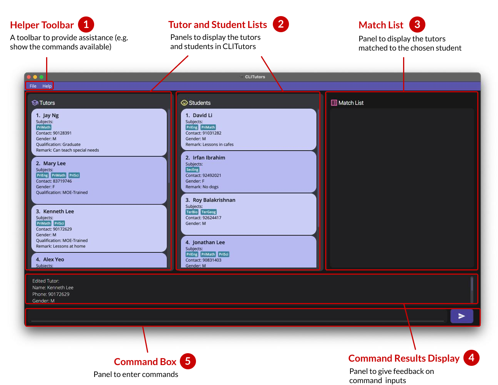
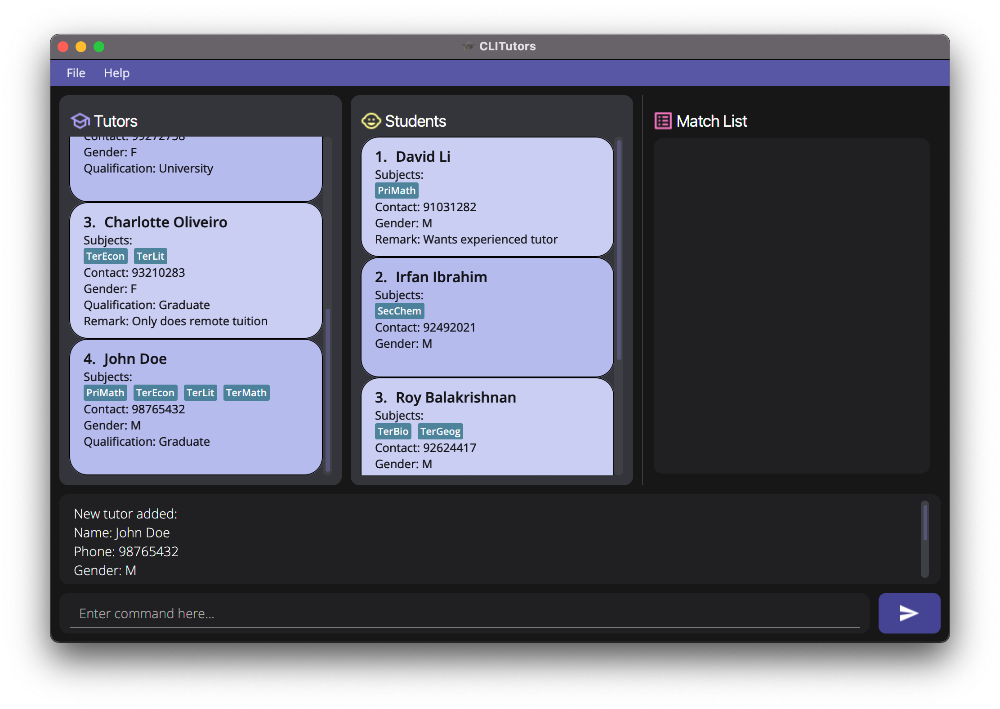
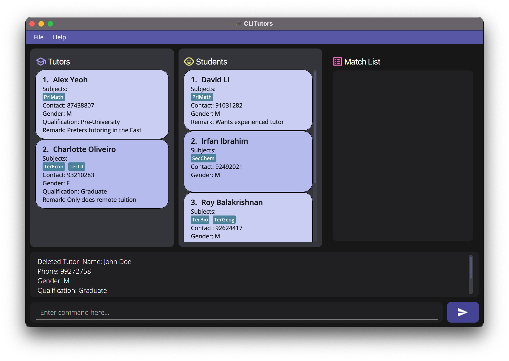
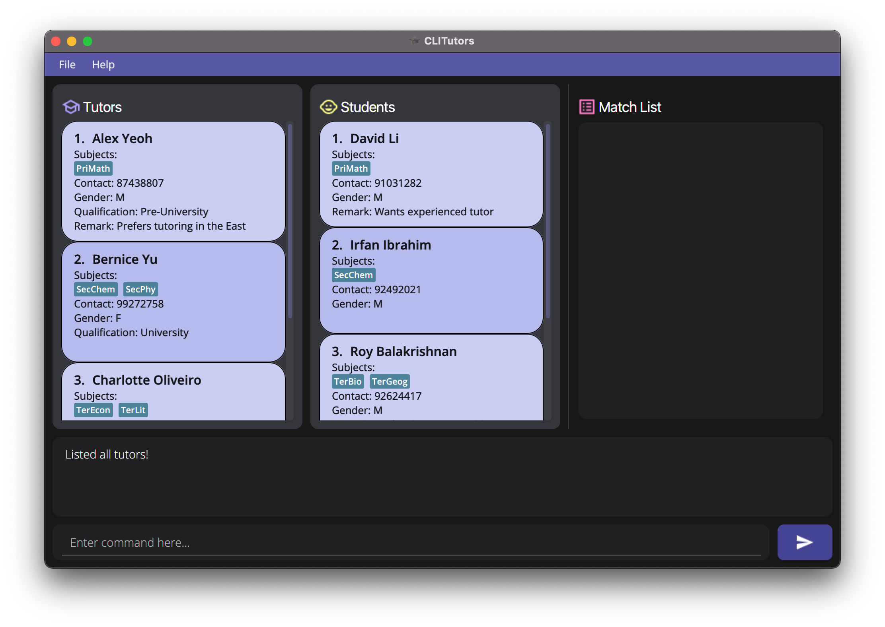
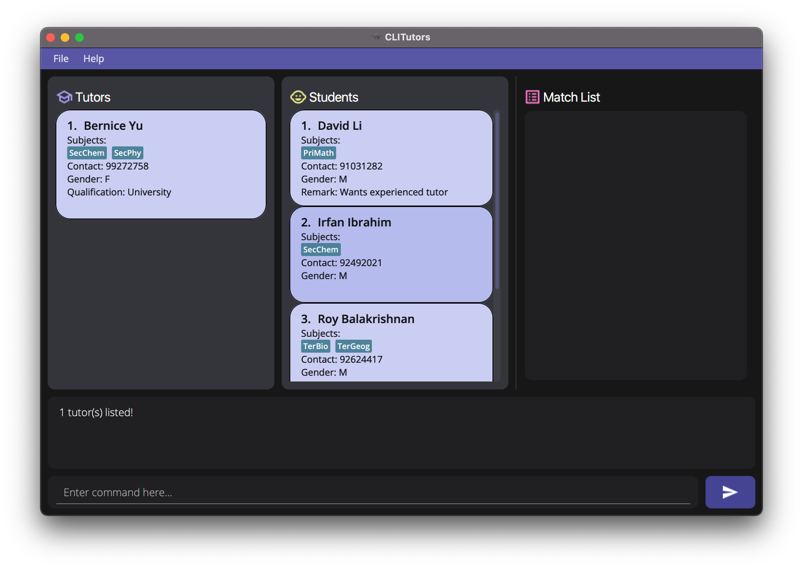
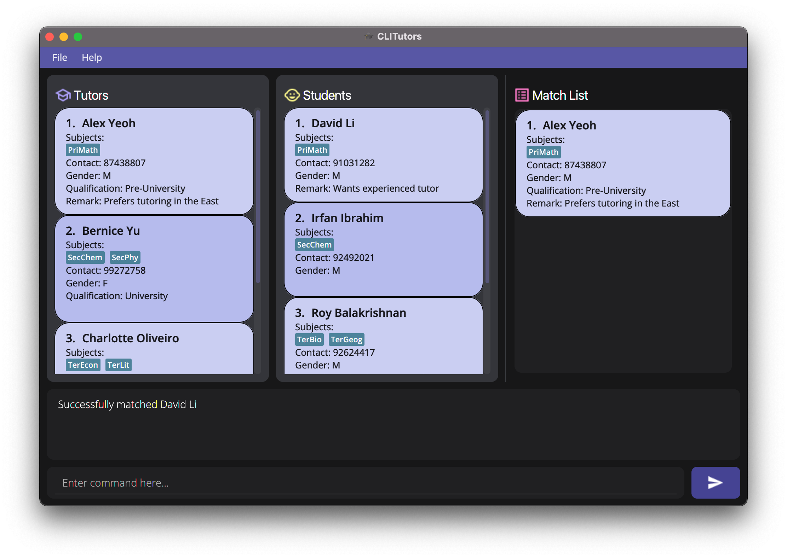
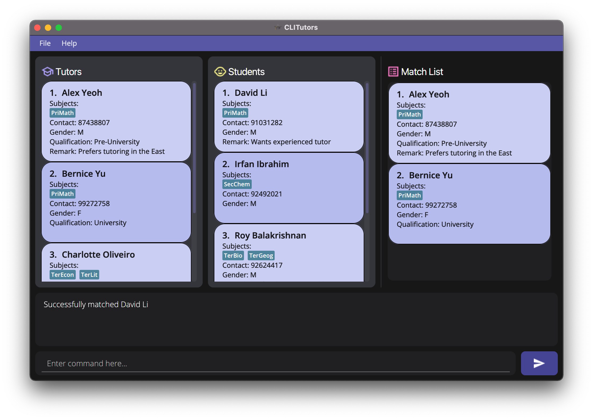
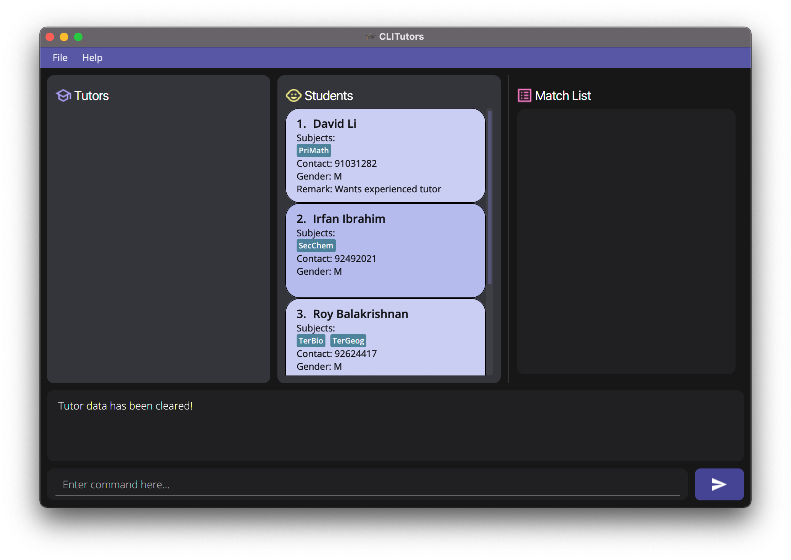

**`CLITutors`** is a desktop app for **managing private tutoring jobs**, optimized for use via a **Command Line Interface (CLI)** while still having the benefits of a Graphical User Interface (GUI). If you are a private tuition agency with a **big list of tutors to manage**, `CLITutors` can help you to manage matching tutors and students for private tuition faster than using a regular database.

## Table of Contents
{: .no_toc}
* Table of Contents
{:toc}

--------------------------------------------------------------------------------------------------------------------
## Navigating the User Guide
Before going into the rest of the content in our user guide, here are a few **important** syntax to take note of to facilitate your reading:

| Syntax              | Description                                         |
| ------------------- | --------------------------------------------------- |
| **Bold**            | Important words to note                             |
| `Codeblock`         | Denotes distinct classes, their methods or examples |
| <kbd>Keyboard</kbd> | Keyboard actions                                    |
| 
:information_source: Note
 | Useful information/tips |
| 
:heavy_exclamation_mark: Caution
 | Important things to take note of |

--------------------------------------------------------------------------------------------------------------------
## Quick start

1. Ensure you have Java `11` or above installed on your computer.

2. [Download](https://github.com/AY2122S1-CS2103T-T17-2/tp/releases/tag/v1.3) the latest `clitutors.jar`.

3. Copy the file to the folder you want to use as the *home folder* for `CliTutors`.

4. **Double-click** the file to start the application. A GUI containing the annotated **5 main components** should show up as below. Note how the application contains some sample data:   

5. Try typing `match 1` in the **Command Box** and press <kbd>Enter</kbd> (or click the ➤ button on the GUI) to execute it.

6. You should see the results appear on the **Match List**. You can see whether your command was successful from the **Command Results Display** as well.

7. For a **quick overview** of all available commands, please refer to our [Command Summary](#command-summary).

8. For the **details** of each command, please proceed to the next section on [Features](#features).

9. When you are ready to start adding your own data, clear the **Tutor and Student Lists** using `clear t` and `clear s` respectively.

10. If you are new and unsure of what the **expected outcomes** are for each command, fret not! You can click on the **dropdown list** under each command that illustrates the *before* and *after* of an example command input.

--------------------------------------------------------------------------------------------------------------------
## Command Syntax
Before diving into the details, let us first look at what makes up a command:

| Component    | Description                                                                |
|:------------ |:-------------------------------------------------------------------------- |
| Command Word | The keyword representing the action of the command                         |
| Preamble     | The keyword representing `Person` and/or `INDEX`                       |
| Prefix       | The keyword to recognise the parameters                                    |
| Parameter    | Argument given directly behind prefix and contains the corresponding value |

<b>:information_source: Note: </b> There are **two** main `Person` types in `CliTutors`, namely `Tutor` and `Student`, represented by `t` and `s` in the preamble respectively.

An example of a basic command to add a tutor could look like the following:

`add t n/John Doe p/98765432 g/M q/2 t/TE TM TL` 

In the example above, `add` is the **command word** and `t` is the **preamble** representing tutor. `n/`, `g/`, `p/`, `q/` and `t/` are the **prefixes** and `John Doe`, `M`, `98765432`, `2`, `TE TM TL` are the **parameters**.

For your convenience, a list of all parameters along with their prefixes has been included in the table below.

| Parameter | Description    | Argument Requirements                                      |
|:---------:|:-------------- | ------------------------------------------------------ |
|    n/     | Name           | Contains alphanumeric characters and spaces, not blank |
|    p/     | Phone Number          | Contain numbers, and it should be 8 digits long        |
|    g/     | Gender         | Must be `M`/`m` for Male, `F`/`f` for Female     |
|    q/     | Qualification  | [Valid qualifications](#valid-qualifications)          |
|    r/     | Remark         | Can contain any string not more than 100 characters        |
|    t/     | Tags           | [Valid tags](#valid-tags)                              |

--------------------------------------------------------------------------------------------------------------------

## Features

<b>:information_source: Notes about the command format:</b> 

- A whitespace **must** be included before every prefix.  
  e.g. `edit t 1 n/Alex Yeo q/2` is acceptable but `edit t 1 n/Alex Yeoq/2` is not.

- Parameters may be entered **in any order, except for tags**. i.e. tags must be entered last in the command.  
  e.g. Both `n/John q/1` and `q/1 n/John` are acceptable. `n/John t/PE q/1` is not acceptable, but `n/John q/1 t/PE` is acceptable.

- Words in `UPPER_CASE` are the parameters to be supplied by the user. 
  e.g. The format `add t n/NAME` can be written as `add t n/John Doe`.

- Parameters in square brackets are **optional**. 
  e.g. `n/NAME [r/REMARK]` can be used as `n/John Doe r/This is a remark` or as `n/John Doe`.

- Parameters with `…` after them can have **multiple arguments** in them. 
  e.g. `t/TAG...` can be used as `t/PM` or `t/PM SC TB` etc.

- If a parameter is expected only once in the command, but you specified it multiple times, only the last occurrence of the parameter will be taken. 
  e.g. if you specify `p/12341234 p/56785678`, only `p/56785678` will be taken.

- Excess parameters for commands that do not take in parameters (such as `help` and `exit`) will be ignored. 
  e.g. if the command specifies `help 123`, it will be interpreted as `help`.

- Commands with `t` modify attributes of **tutors** while commands with `s` modify attributes of **students**. 
  e.g. `delete t 1` stands for deleting the tutor at index `1` in the list of tutors.

- For `Commands` with the format "`Command Word` / `Alias`", the `Command Word` can be substituted for its `Alias`.  
e.g. Both `delete t 1` and `d t 1` represent the same command.

### Viewing help: `help`

Shows a message with all the commands available to use on `CliTutors`.

Expected outcome:

 

### Adding a tutor or student: `add` / `a`

Adds a tutor/student to CLITutors.

Format: 
`add t n/NAME p/PHONE_NUMBER g/GENDER q/QUALIFICATION [r/REMARK] t/TAG...` 
`add s n/NAME p/PHONE_NUMBER g/GENDER [r/REMARK] t/TAG...`

<b>:information_source: Note:</b> 

- We support adding of tutors/students with the same name.

- Tutors/students with the <b>same phone number will be counted as duplicates</b> in our app.

Examples: 
`add t n/John Doe p/98765432 g/M q/2 t/PM TE TM TL` 
`a s n/Mary Sue p/98765432 g/F r/Wants tutor urgently t/PM PE`

Expected outcome:

Command Executed: <code>add t n/John Doe p/98765432 g/M q/2 t/PM TE TM TL</code>

Before:

 

After:

### Editing a tutor or student: `edit` / `e`

Edits an existing tutor/student in CLITutors.

Format: 
`edit t INDEX [n/NAME] [p/PHONE_NUMBER] [g/GENDER] [q/QUALIFICATION] [r/REMARK] [t/TAG...]`  
`edit s INDEX [n/NAME] [p/PHONE_NUMBER] [g/GENDER] [r/REMARK] [t/TAG...]`

* Edits the tutor/student at the specified `INDEX`. The index refers to the index number shown in the **displayed tutor/student list**. The index **must be a positive integer**, i.e. 1, 2, 3...
* **At least one** of the optional fields must be provided.
* Existing values will be updated to the input values.
* You must specify **at least one** tag when editing the tags with `t/`.

<b>:heavy_exclamation_mark: Caution:</b>  

- Editing information of any `Person` will override the current information stored about the specified `Person`.

- When editing tags, the existing tags of the tutor/student will be removed i.e. adding of tags is not cumulative.

Examples: 
`edit t 3 n/John Doe g/M q/2 t/PM TE TM TL` 
`e s 9 n/Mary Sue p/98765432`

Expected outcome:

Command Executed: <code>edit t 3 n/John Doe g/M q/2 t/PM TE TM TL</code>

Before:

 

After:

### Deleting a tutor or student: `delete` / `d`

Deletes the tutor/student at the specified `INDEX` from CLITutors.

Format: 
`delete t INDEX` 
`delete s INDEX`

- The `INDEX` refers to the index number shown on the **displayed tutor/student list**.
- The `INDEX` **must be a positive integer**.   e.g. `1`, `2`, `3`, ...

Examples: 
`list t` followed by `delete t 2` deletes the 2nd person in the tutor list.  
`find n/Betsy` followed by `d t 1` deletes the 1st person in the results of the find command for the tutor list.

Expected outcome:

Command Executed: <code>delete t 2</code>

Before:

 

After:

### Listing all tutors or students: `list` / `l`

Shows the list of all tutors/students.

Format:  `list t`   `list s`

Expected outcome:

Commands Executed: <code>find t g/M</code>, then <code>list t</code>

Before (when <code>find t g/M</code> is executed):

 

After:

### Finding a tutor or student: `find` / `f`

Finds tutor(s)/student(s) that match with the specified parameters.

Format:  
`find t [n/NAME] [g/GENDER] [q/QUALIFICATION] [t/TAG...]`  
`find s [n/NAME] [g/GENDER] [t/TAG...]`
- The search is case-insensitive.  
  e.g. `n/hans` will match `Hans`.
- Only full words will be matched.  
  e.g. `n/Han` will not match `Hans`, and `n/Han Solo` will not match `Han Dan`.
- **At least one** of the optional fields must be provided.
- You must specify **at least one** tag when finding tags with `t/`.

Example: 
`find t n/Yu t/SC` 
`f s g/M t/PS`

Expected outcome:

Command Executed: <code>find t n/Yu t/SC</code>

Before:

 

After:

### Matching a student to tutor(s): `match` / `m`

Finds tutor(s) who teaches the subject that the student wants.

Format:  `match INDEX`
- The `INDEX` refers to the index number shown on the **displayed student list**.
- The `INDEX` **must be a positive integer**.   e.g. `1`, `2`, `3`, ...

Example: 
`match 1` 
`m 1`

Expected outcome:

Command Executed: <code>match 1</code>

Before:

 

After:

### Filtering tutors from the matched tutors: `filter`

Filters tutor(s) from the list of **matched** tutors.

Format:  `filter [n/NAME] [g/GENDER] [q/QUALIFICATION]`
- The search is case-insensitive.  
  e.g. `n/hans` will match `Hans`.
- Only the last name given is searched.  
  e.g. `filter n/John n/Amy` will find names that match `Amy`.
- Only full words will be matched.  
  e.g. `n/Han` will not match `Hans`, and `n/Han Solo` will not match `Han Dan`.
- **At least one** of the optional fields must be provided.

<b>:heavy_exclamation_mark: Caution:</b>  

* `filter` cannot be used on an empty Match List.
* Users are expected to type the `match` command again if they wish to apply `filter` individually, as multiple `filter` commands used concurrently on a non-empty Match List will **continue to narrow down** the search.

Example: 
`filter g/F`

Expected outcome:

Commands Executed: <code>match 1</code>, then <code>filter g/F</code>

Before (when <code>match 1</code> is executed):

 

After:

### Clearing all entries: `clear`

Clears all entries of tutors/students from CLITutors.

Format:  `clear t`   `clear s`

Expected outcome:

Command Executed: <code>clear t</code>

Before:

 

After:

### Exiting the program: `exit`

Exits the CLITutors application.

Format:  `exit`

### Saving the data

`CliTutors` data is saved in the hard disk automatically after any command that changes the data. There is no need to save manually.

### Editing the data file

`CliTutors` data is saved as a JSON file `[JAR file location]/data/clitutors.json`. Advanced users are welcome to update data directly by editing that data file.

<b>:heavy_exclamation_mark: Caution:</b> If the data file's format is invalid after manual changes, `CliTutors` will discard all data and start with an empty data file at the next run.

--------------------------------------------------------------------------------------------------------------------
## FAQ

**Q**: How do I transfer my data to another Computer?

**A**: Install the application on the other computer and place your current data folder in the same directory as the newly installed application (overwrite the data folder of the new application if applicable).

**Q**: Where is the data of CLITutors saved?

**A**: CLITutors' data is saved automatically after every command into a JSON file named clitutors.json. This file is stored within the data folder in the same location as the application JAR file and is created after the initial launch (and upon a command execution) of a fresh installation.

--------------------------------------------------------------------------------------------------------------------
## Command Summary

|   Action   | Format, Examples |
|:----------:|:---------------- |
|  **Add**   | `add t n/NAME p/PHONE_NUMBER g/GENDER q/QUALIFICATION [r/REMARK] t/TAG...`  `add s n/NAME p/PHONE_NUMBER g/GENDER [r/REMARK] t/TAG...`   e.g. `add t n/John Doe p/98765432 g/M q/3 r/Prefers students in Bishan t/PM`    |
| **Delete** | `delete t INDEX`   `delete s INDEX`   e.g. `delete s 3`                 |
|  **Help**  | `help`           |
|  **Edit**  | `edit t INDEX [n/NAME] [p/PHONE_NUMBER] [g/GENDER] [q/QUALIFICATION] [r/REMARK] [t/TAG...]`  `edit s INDEX [n/NAME] [p/PHONE_NUMBER] [g/GENDER] [r/REMARK] [t/TAG...]`  e.g. `edit t 2 n/John Doe q/1`   |
|  **List**  | `list t`   `list s`           |
|  **Find**  | `find t [n/NAME] [g/GENDER] [q/QUALIFICATION] [t/TAG...]`   `find s [n/NAME] [g/GENDER] [t/TAG...]`   e.g. `find s n/John`  |
| **Match**  | `match INDEX`   e.g. `match 1`          |
| **Filter**  | `filter [n/NAME] [g/GENDER] [q/QUALIFICATION]` Note: must have **at least one** optional field     |
| **Clear**  | `clear t`   `clear s`          |
|  **Exit**  | `exit`           |

--------------------------------------------------------------------------------------------------------------------
## Appendix

### Valid Tags

`Tag` is derived from [**LEVEL**][**SUBJECT**] e.g. **PM** is Primary Math. 
The application supports the following level of education and subjects as shown in the table below.

<table>
    <thead>
        <tr>
            <th style="text-align:center; padding: 10px">Education Level</th>
            <th style="text-align:center">Subjects</th>
            <th style="text-align:center">Tag</th>
        </tr>
    </thead>
    <tbody>
        <tr>
            <td rowspan=3><b>P</b>rimary</td>
            <td><b>E</b>nglish</td>
            <td style="text-align:center"><b>PE</b></td>
        </tr>
        <tr>
            <td><b>M</b>ath</td>
            <td style="text-align:center"><b>PM</b></td>
        </tr>
        <tr>
            <td><b>S</b>cience</td>
            <td style="text-align:center"><b>PS</b></td>
        </tr>
        <tr>
        <td rowspan=8><b>S</b>econdary</td>
            <td><b>B</b>iology</td>
            <td style="text-align:center"><b>SB</b></td>
        </tr>
        <tr>
            <td><b>C</b>hemistry</td>
            <td style="text-align:center"><b>SC</b></td>
        </tr>
        <tr>
            <td><b>E</b>nglish</td>
            <td style="text-align:center"><b>SE</b></td>
        </tr>
        <tr>
            <td><b>G</b>eography</td>
            <td style="text-align:center"><b>SG</b></td>
        </tr>
        <tr>
            <td><b>H</b>istory</td>
            <td style="text-align:center"><b>SH</b></td>
        </tr>
        <tr>
            <td><b>L</b>iterature</td>
            <td style="text-align:center"><b>SL</b></td>
        </tr>
        <tr>
            <td><b>M</b>ath</td>
            <td style="text-align:center"><b>SM</b></td>
        </tr>
        <tr>
            <td><b>P</b>hysics</td>
            <td style="text-align:center"><b>SP</b></td>
        </tr>
        <tr>
            <td rowspan=8><b>T</b>ertiary</td>
            <td><b>B</b>iology</td>
            <td style="text-align:center"><b>TB</b></td>
        </tr>
        <tr>
            <td><b>C</b>hemistry</td>
            <td style="text-align:center"><b>TC</b></td>
        </tr>
        <tr>
            <td><b>E</b>conomics</td>
            <td style="text-align:center"><b>TE</b></td>
        </tr>
        <tr>
            <td><b>G</b>eography</td>
            <td style="text-align:center"><b>TG</b></td>
        </tr>
        <tr>
            <td><b>H</b>istory</td>
            <td style="text-align:center"><b>TH</b></td>
        </tr>
        <tr>
            <td><b>L</b>iterature</td>
            <td style="text-align:center"><b>TL</b></td>
        </tr>
        <tr>
            <td><b>M</b>ath</td>
            <td style="text-align:center"><b>TM</b></td>
        </tr>
        <tr>
            <td><b>P</b>hysics</td>
            <td style="text-align:center"><b>TP</b></td>
        </tr>
    </tbody>
</table>

<b>:information_source: Note: </b> Tags are case insensitive.

### Valid Qualifications

Here are the possible categories of qualifications for tutors:

- Qualifications
    - `0`: Pre-University
    - `1`: University Student
    - `2`: Graduate
    - `3`: MOE-Trained
